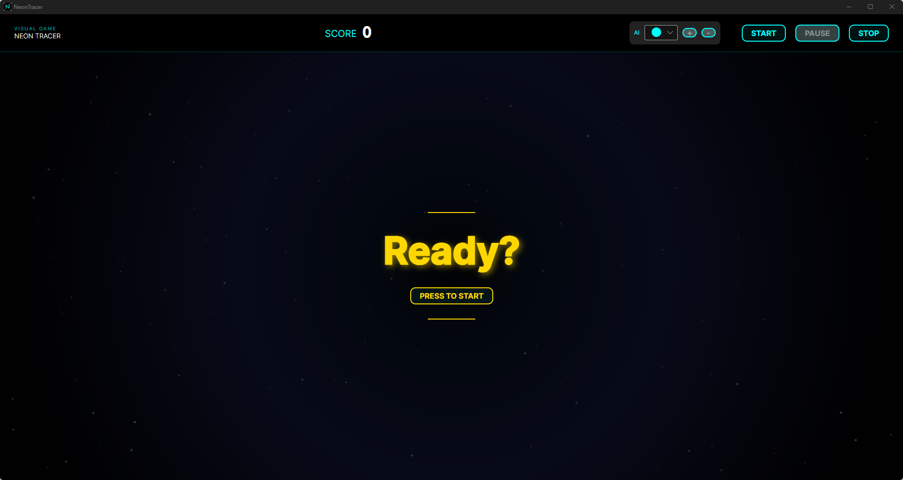
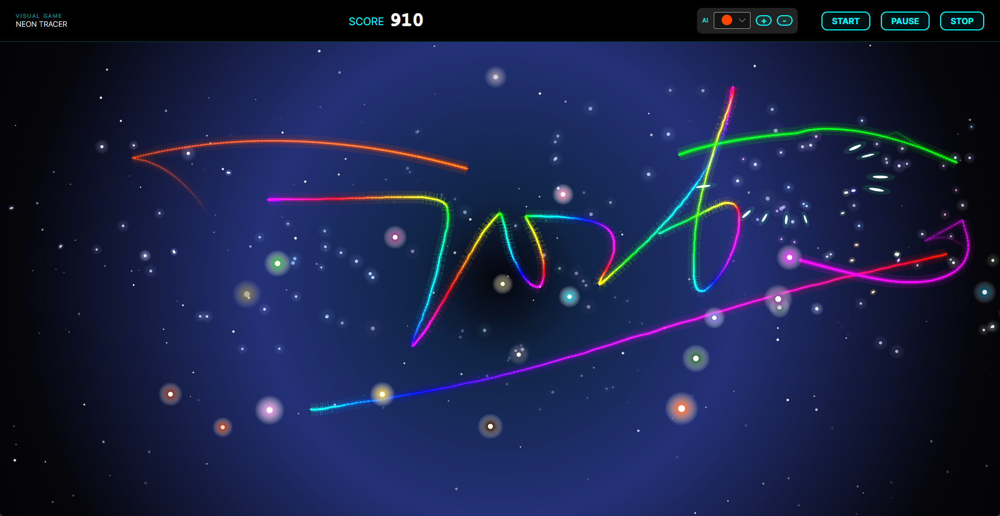
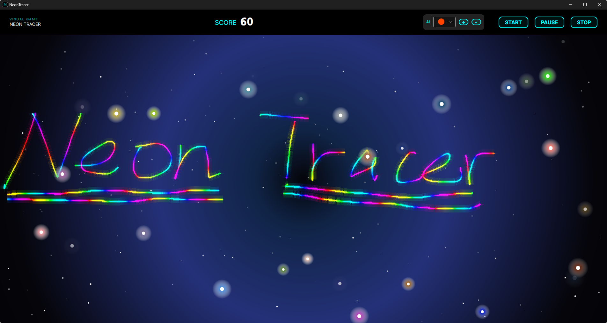

# NeonTracer

A small game built with Avalonia and drawn using Skia

---

### 游戏概要

在这里你可以使用光标绘出炫酷的曲线，尝试用它来攻击霓虹粒子来获取更高的分数！(如果你比较懒也可以启动自动追踪光线让AI帮你打工:smile:) 

---

### 实现核心

整个游戏核心部件由以下三部分构成

> `GameCanvas`:**自定义控件**，游戏渲染的核心部分，通过调用SkiaSharp API渲染出鼠标轨迹，粒子效果，游戏背景等。
>
> `GameEngine`:**游戏引擎**，游戏逻辑的核心部分，实现每个元素的状态更新，碰撞检测，自动跟踪等功能。
>
> `GameView[Model]`:**前端页面**，游戏画面的核心部分，呈现给玩家更好的交互体验。

#### 实体创建

使用对象池来管理每个继承了`IPoolable`接口对象的创建与回收。为了实现对象状态的更新，每一个需要被渲染的对象都需要实现`Update`方法用于在游戏逻辑部分调用以更新对象状态。

#### 自动追踪

在每一帧，将所有霓虹粒子递归地存储在四叉树内，每次`AutoTracker`只需要给四叉树传递位置信息就能寻找到附近最近的粒子，将查询最近粒子的时间复杂度从$O(N)$降低到$O(\log N)$。

### 游戏画面

